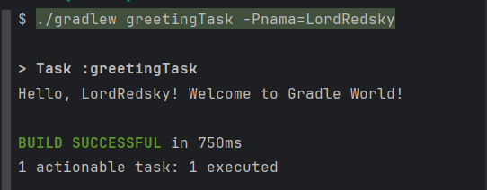

## Gradle Project

### Membuat gradle project test sederhana dengan memanfaatkan Framework JUnit
kamu bisa menjalankan project ini dengan menjalankan perintah
```"./gradlew greetingTask -Pnama=YourName"```

### contoh :
